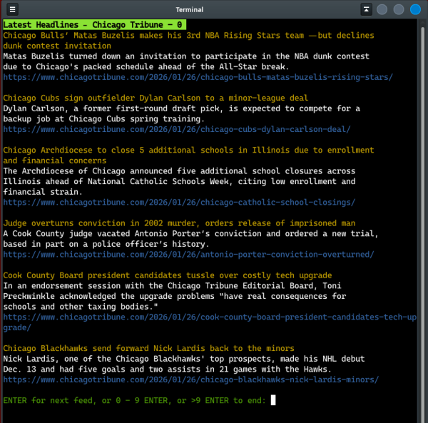

# NKiosk RSS Viewer
### Runs in Terminal 

**Headlines at your fingertips**

Consists of two files: `nkiosk.py` and `nkiosk.lst`

Requires:

        beautifulsoup4==4.14.3
        Requests==2.32.5
        termcolor==3.3.0

Suggested usage:

        xfce4-terminal --geometry=88x50+100+20 -x news.sh &

        news.sh
            cd /p a t h/NKiosk
            python3 nkiosk.pyc

>Any terminal that supports __geometry__ is fine.

---

>

---

> RSS urls stored in separate text file `nkiosk.lst`

>>
    https://www.chicagotribune.com/latest-headlines/feed/
    https://feeds.npr.org/1002/rss.xml
    https://feeds.npr.org/1003/rss.xml
    https://feeds.npr.org/1004/rss.xml
    https://feeds.npr.org/1014/rss.xml
    https://feeds.npr.org/1128/rss.xml
    http://rss.nytimes.com/services/xml/rss/nyt/HomePage.xml
    http://rss.nytimes.com/services/xml/rss/nyt/World.xml
    http://rss.nytimes.com/services/xml/rss/nyt/US.xml
    https://news.google.com/rss?hl=en-US&gl=US&ceid=US:en

---
inspired by the book:

*Automate the Boring Stuff with Python*  
By Al Sweigart
	